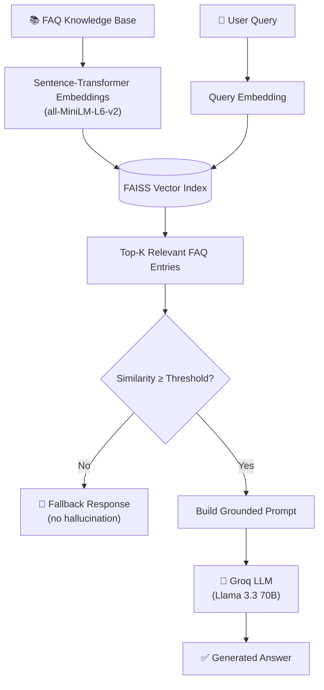

<div align="center">

# 🤖 Smart FAQ Chatbot (RAG-Based System)

### A Retrieval-Augmented Generation chatbot — semantic search over an FAQ knowledge base, grounded LLM answers, zero hallucination by design.


[Overview](#-overview) • [Features](#-features) • [How It Works](#-how-it-works) • [Getting Started](#-getting-started) • [API Reference](#-api-reference)

</div>

---

## 📌 Overview

An advanced FAQ chatbot that goes beyond keyword matching. FAQ entries are
embedded with **sentence-transformers** and stored in a **FAISS** vector
index for fast semantic search. On every query, the top-matching FAQ entries
are retrieved and passed as grounded context to a free-tier LLM
(**Groq / Llama 3.3 70B**), which generates a natural-language answer —
strictly based on the retrieved context, with a built-in fallback so the bot
never makes things up.

Built as part of the **Calder AI/ML Internship** project assignment.

## ✨ Features

- 🧬 **Semantic search** via sentence embeddings — understands meaning, not just keywords
- ⚡ **FAISS vector index** for fast similarity search
- 🧠 **LLM-generated answers**, grounded in retrieved context only
- 🛡️ **Anti-hallucination fallback** — returns "I don't know" instead of guessing when confidence is low
- 💸 **Zero-cost LLM** via Groq's free tier
- 🔌 **Graceful degradation** — works without an API key by falling back to retrieval-only mode
- 📚 **Easily extensible** knowledge base (just edit a JSON file)

## 🧠 How It Works



## 🛠️ Tech Stack

| Component     | Technology                                   |
| ------------- | -------------------------------------------- |
| API Framework | FastAPI + Uvicorn                            |
| Embeddings    | sentence-transformers (`all-MiniLM-L6-v2`) |
| Vector Search | FAISS                                        |
| Generation    | Groq API (Llama 3.3 70B)                     |

## 📁 Project Structure

```
rag-faq-chatbot/
├── knowledge_base/
│   └── faq_data.json     # FAQ knowledge base
├── rag_engine.py          # embeddings, FAISS index, retrieval + answer logic
├── llm_client.py          # Groq API wrapper (generation step)
├── app.py                 # FastAPI application
├── .env.example
├── requirements.txt
└── README.md
```

## 🚀 Getting Started

### Prerequisites

- Python 3.10+
- A free [Groq API key](https://console.groq.com) (optional — see note below)

### Installation

```bash
git clone https://github.com/<your-username>/rag-faq-chatbot.git
cd rag-faq-chatbot

python -m venv venv
source venv/bin/activate        # Windows: venv\Scripts\activate

pip install -r requirements.txt
cp .env.example .env
```

Add your free Groq key to `.env`:

```
GROQ_API_KEY=your_key_here
```

> 💡 The first run downloads the `all-MiniLM-L6-v2` embedding model (~80MB) from Hugging Face — requires internet once, then it's cached locally.

### Run the API

```bash
uvicorn app:app --reload
```

Open **http://127.0.0.1:8000/docs** for interactive Swagger documentation.

## 📡 API Reference

| Method   | Endpoint  | Description                        |
| -------- | --------- | ---------------------------------- |
| `GET`  | `/`     | Health check + knowledge base size |
| `POST` | `/chat` | Ask the chatbot a question         |

### Example Request

```bash
curl -X POST http://127.0.0.1:8000/chat \
  -H "Content-Type: application/json" \
  -d '{"message": "How do I get my money back for a return?"}'
```

### Example Response

```json
{
  "query": "How do I get my money back for a return?",
  "answer": "You can get a full refund within 14 days of purchase as long as the item is unused and in its original packaging. Refunds are processed within 5-7 business days.",
  "source": "rag_generated",
  "retrieved_context": [
    { "question": "What is your refund policy?", "answer": "...", "score": 0.81 }
  ]
}
```

## 🧩 Design Notes

| Behavior                | Why                                                                                                  |
| ----------------------- | ---------------------------------------------------------------------------------------------------- |
| No `GROQ_API_KEY` set | Falls back to retrieval-only mode (`"source": "retrieval_only"`) — fully demoable with zero setup |
| Low similarity score    | Returns a clear fallback message instead of letting the LLM guess                                    |
| Adding FAQs             | Just append to `knowledge_base/faq_data.json` — index rebuilds automatically on startup           |

## 📄 License

This project is licensed under the MIT License — see the [LICENSE](LICENSE) file for details.

---

<div align="center">

**Built by [Your Name]** · [GitHub](https://github.com/<your-username>) · [LinkedIn](https://linkedin.com/in/<your-profile>)

</div>
